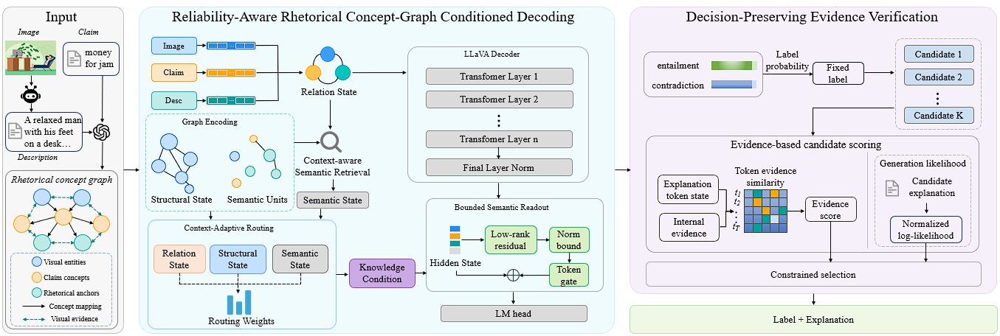

# R-CARE



*R-CARE model architecture: concept-graph conditioning, bounded semantic readout, and evidence-based explanation selection.*

**Reliability-Aware Concept-Graph Conditioning and Evidence Verification for Visual Figurative Language Reasoning**

R-CARE combines reliability-aware concept-graph conditioning with evidence-based explanation selection. It predicts a figurative-language relation, generates explanations under the fixed label, and selects a candidate using multimodal evidence and a generation-likelihood constraint.

## Repository layout

| Path | Contents |
| --- | --- |
| `train.py` | Final combined-model training; saves one `model.pt` checkpoint. |
| `infer.py` | Inference with the historical LLaVA loading and generation path. |
| `evaluate.py` | Calls the original benchmark metric script. |
| `data/` | Four fully synthetic examples, images, graph records, and CSV examples. |
| `assets/` | Model architecture diagram. |
| `docs/` | Reproduction requirements and output layout. |

## Run the final model

The full experiment requires your own copies of the base LLaVA model, the original task project, the official dataset and its extracted features. Set the paths in your environment; no private paths are stored in this repository.

```bash
export RIFT_ORIG_ROOT=/path/to/original-task-project
export LLAVA_MODEL_PATH=/path/to/base-llava-model
export PAPER2_OUTPUT_ROOT=/path/to/output

python train.py
python infer.py
python evaluate.py
```

`train.py` writes `checkpoints_r_care/model.pt`. `infer.py` writes predictions under `result/r_care/`. `evaluate.py` passes those predictions to the original benchmark metric implementation. See [reproduction notes](docs/reproducibility.md) for the required inputs and optional arguments.

The [example dataset](data/README.md) demonstrates the input and output formats. Its images and records are synthetic and are not a substitute for the official benchmark or the model-derived feature files. We do not distribute model weights, benchmark data, generated caches, or evaluation logs.
